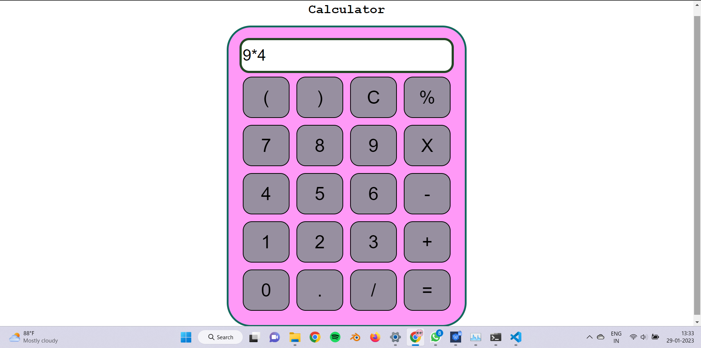

# Design of a Standard Calculator

## AIM:

To design a web application for a standard calculator.

## DESIGN STEPS:

### Step 1:
Create django project using django commands and add a static folder


### Step 2:
Create a HTML folder,Javascript Folder, CSS folder to create files.

### Step 3:
Write Javascript code and CSS code and link it to the HTML file

### Step 4:
Run the server and get screenshot of your output from webpage.

### Step 5:
Validate the HTML and CSS code.

### Step 6:
Publish the website in the given URL.

### Step 6:
Upload the README.md file to the Github repository.

## PROGRAM :
```
HTML CODE:
<!DOCTYPE html>
<html lang="en">

<head>
    <meta charset="UTF-8">
    <meta name="viewport" content="width=device-width, initial-scale=1.0">
    <meta http-equiv="X-UA-Compatible" content="ie=edge">
    <link rel="stylesheet" href="./CSS/style.css">
    <title>Calculator</title>
</head>

<body>
    <div class="container">
        <h1>Calculator</h1>

        <div class="calculator">
            <input type="text" name="screen" id="screen">
            <table>
                <tr>
                    <td><button>(</button></td>
                    <td><button>)</button></td>
                    <td><button>C</button></td>
                    <td><button>%</button></td>
                </tr>
                <tr>
                    <td><button>7</button></td>
                    <td><button>8</button></td>
                    <td><button>9</button></td>
                    <td><button>X</button></td>
                </tr>
                <tr>
                    <td><button>4</button></td>
                    <td><button>5</button></td>
                    <td><button>6</button></td>
                    <td><button>-</button></td>
                </tr>
                <tr>
                    <td><button>1</button></td>
                    <td><button>2</button></td>
                    <td><button>3</button></td>
                    <td><button>+</button></td>
                </tr>
                <tr>
                    <td><button>0</button></td>
                    <td><button>.</button></td>
                    <td><button>/</button></td>
                    <td><button>=</button></td>
                </tr>
            </table>
        </div>
    </div>

</body>
<script src="./JS/index.js"></script>

</html>
```
```
JAVASCRIPT CODE:
let screen = document.getElementById('screen');
buttons = document.querySelectorAll('button');
let screenValue = '';
for (item of buttons) {
    item.addEventListener('click', (e) => {
        buttonText = e.target.innerText;
        console.log('Button text is ', buttonText);
        if (buttonText == 'X') {
            buttonText = '*';
            screenValue += buttonText;
            screen.value = screenValue;
        }
        else if (buttonText == 'C') {
            screenValue = "";
            screen.value = screenValue;
        }
        else if (buttonText == '=') {
            screen.value = eval(screenValue);
        }
        else {
            screenValue += buttonText;
            screen.value = screenValue;
   }

})
}
```
```
CSS CODE:
.container{
    text-align: center;
    margin-top:23px
}

table{
    margin: auto;
}

input{
    border-radius: 21px;
    border: 5px solid #244624;
    font-size:34px;
    height: 65px;
    width: 456px;
}

button{
    border-radius: 20px;
    font-size: 40px;
    background: #978fa0;
    width: 102px;
    height: 90px;
    margin: 6px;
}

.calculator{ 
    border: 4px solid #13695d;
    background-color: #ff99f7;
    padding: 23px;
    border-radius: 53px;
    display: inline-block;
    
}

h1{
    font-size: 28px;
    font-family: 'Courier New', Courier, monospace;
}
```
## OUTPUT:


## Result:
The Calculator using Javascript is succesfully executed.
